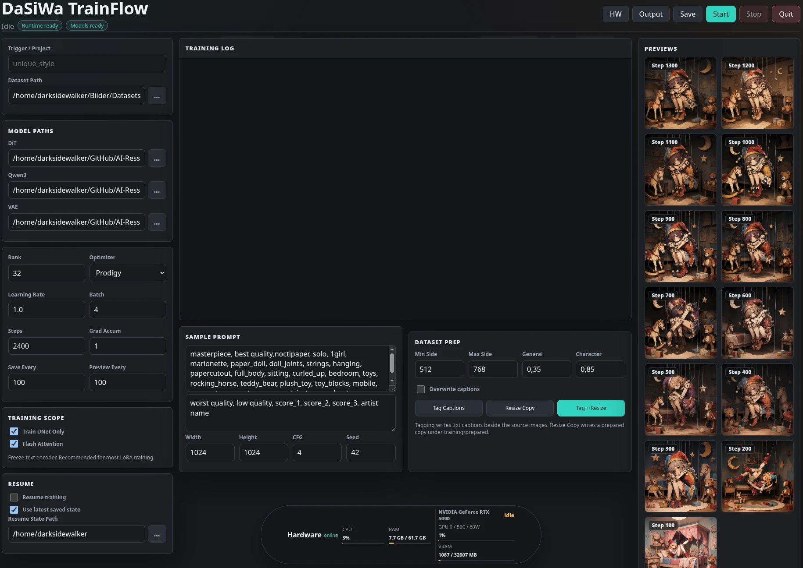

# DaSiWa TrainFlow

DaSiWa TrainFlow is a portable Go shell for training LoRA on the Anima model family. It wraps the existing Python/`sd-scripts` training stack with a modern embedded UI, clickable path pickers, resumable training, live preview refresh, and a compact hardware monitor for Linux and Windows.



Repository: <https://github.com/darksidewalker/TrainFlow>

## Quick Download

Linux with Git:

```bash
git clone --depth 1 https://github.com/darksidewalker/TrainFlow.git && cd TrainFlow && chmod +x TrainFlow TrainFlow_Runtime_Tool && ./TrainFlow_Runtime_Tool
```

Linux without Git:

```bash
curl -L -o TrainFlow.zip https://github.com/darksidewalker/TrainFlow/archive/refs/heads/main.zip && unzip TrainFlow.zip && cd TrainFlow-main && chmod +x TrainFlow TrainFlow_Runtime_Tool && ./TrainFlow_Runtime_Tool
```

Windows PowerShell with Git:

```powershell
git clone --depth 1 https://github.com/darksidewalker/TrainFlow.git; cd TrainFlow; .\TrainFlow_Runtime_Tool.exe
```

Windows PowerShell without Git:

```powershell
Invoke-WebRequest -Uri https://github.com/darksidewalker/TrainFlow/archive/refs/heads/main.zip -OutFile TrainFlow.zip; Expand-Archive TrainFlow.zip -Force; cd TrainFlow-main; .\TrainFlow_Runtime_Tool.exe
```

The runtime tool opens a local installer UI. Click **Verify Runtime** first if you downloaded a fully bundled build. Click **Update Runtime** for a fresh platform runtime, or **Install Requirements** if Python is already present but dependencies need repair.

## Run

Linux:

```bash
./TrainFlow
```

Windows:

```powershell
.\TrainFlow.exe
```

Open the UI at `http://127.0.0.1:7860` if your browser does not open automatically.

## Runtime Tool

Linux:

```bash
./TrainFlow_Runtime_Tool
```

Windows:

```powershell
.\TrainFlow_Runtime_Tool.exe
```

The runtime tool:

- creates or updates `python_embeded`
- uses `python_embeded/windows` on Windows
- uses `python_embeded/linux` on Linux
- installs `uv` into that runtime
- installs dependencies into the embedded/local runtime with `uv pip install --python ...`
- falls back to `python -m pip install` if uv fails
- installs PyTorch CUDA 13.0 wheels from `https://download.pytorch.org/whl/cu130`

Windows uses the official Python 3.12.10 embeddable package. Linux creates a local `python_embeded/linux` venv using `python3.12` when available, otherwise `python3`. The app still supports the old flat `python_embeded` folder as a fallback, but platform-specific folders are the shipping layout.

## Shipping Runtime Files

Do not commit `python_embeded/` to Git. It is intentionally ignored because the local runtime can contain many thousands of files plus very large ML wheels, which quickly hits GitHub file and repository limits.

For normal installs, ship the root binaries and let the runtime tool create the platform runtime on the user's machine:

- Windows: `TrainFlow.exe` and `TrainFlow_Runtime_Tool.exe`
- Linux: `TrainFlow` and `TrainFlow_Runtime_Tool`

If a platform runtime is missing, the user can open `TrainFlow_Runtime_Tool` and click **Update Runtime** once. That creates or updates `python_embeded/windows` on Windows and `python_embeded/linux` on Linux.

If you need a fully offline/prebuilt package, create a release ZIP or 7z outside Git that contains the binaries plus the matching `python_embeded/<platform>` folder. Upload that archive as a GitHub Release asset or host it separately. Compressing the runtime into the Go executable is not recommended: the archive would still be huge, platform-specific, slow to build, and would need to be unpacked before Python and native wheels can run.

## Build From Source

You do not need this for normal use if the repo ships the portable binaries. Use this only when changing Go code or rebuilding release artifacts.

Linux app binaries:

```bash
go build -trimpath -ldflags="-s -w" -o TrainFlow ./cmd/trainflow
go build -trimpath -ldflags="-s -w" -o TrainFlow_Runtime_Tool ./cmd/runtime-tool
```

Windows and Linux release binaries from Windows PowerShell:

```powershell
.\build.ps1
```

Outputs include:

```text
TrainFlow
TrainFlow.exe
TrainFlow_Runtime_Tool
TrainFlow_Runtime_Tool.exe
dist/trainflow-linux-amd64
dist/trainflow-windows-amd64.exe
dist/trainflow-runtime-tool-linux-amd64
dist/trainflow-runtime-tool-windows-amd64.exe
```

## Workflow

1. Run the runtime tool and install/update dependencies.
2. Run `TrainFlow` or `TrainFlow.exe`.
3. Use the Browse buttons to select model files and dataset folders.
4. Set trigger word, rank, optimizer, steps, and preview settings.
5. Click **Start**.
6. Click **Quit** in the top bar when you want to terminate the local TrainFlow server.

## Resume Training

The UI includes a **Resume** panel:

- **Resume training** enables `sd-scripts` state resume.
- **Use latest saved state** searches the project output folder for the newest `*-state` directory.
- **Resume State Path** lets you choose a specific state folder.

Training configs write `save_state = true`, `save_last_n_steps_state = 1`, and `save_last_n_epochs_state = 1`, so new runs keep resumable state.

## Features

- Go binary with embedded HTML/CSS/JS UI
- Linux and Windows support
- clickable local path selectors
- configurable Train UNet Only setting, enabled by default
- live logs and preview gallery
- compact hardware monitor under the sampler settings
- CPU, RAM, CPU temperature where available, and NVIDIA GPU stats
- resumable training from saved state folders
- runtime installer/updater with uv-first dependency installation
- portable Python runtime folders at `python_embeded/windows` and `python_embeded/linux`

## Required Models

Place model files under `models/` or select them from anywhere with the Browse buttons.

Optional prep models:

```bash
git clone https://huggingface.co/SmilingWolf/wd-eva02-large-tagger-v3 models/wd-eva02-large-tagger-v3
curl -L -o models/u2net/u2net.onnx https://github.com/danielgatis/rembg/releases/download/v0.0.0/u2net.onnx
```

## Requirements

- Go 1.22+ if building from source
- Python 3.12 recommended for Linux runtime creation
- NVIDIA GPU recommended for training
- `nvidia-smi` for GPU overlay stats
- Git for clone-based install

## Credits

DaSiWa TrainFlow is based on and credits the original [Anima TrainFlow](https://github.com/ThetaCursed/Anima-TrainFlow) project by ThetaCursed, plus the modified `sd-scripts` training stack used by that project. This fork/rewrite adds the Go portable shell, runtime updater, path picker, hardware overlay, and resume workflow around that foundation.
