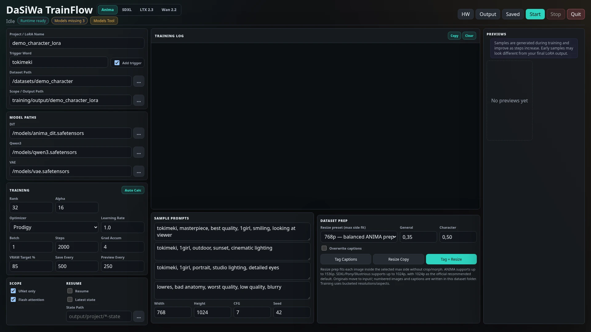

# DaSiWa TrainFlow

DaSiWa TrainFlow is a portable Go shell for training LoRAs on Anima and SDXL-family models such as Pony and Illustrious. It wraps the existing Python/`sd-scripts` training stack with a modern embedded UI, clickable path pickers, dataset prep tools, resumable training, live preview refresh, and a compact hardware monitor for Linux and Windows.



Repository: <https://github.com/darksidewalker/DaSiWa-TrainFlow>

## Quick Download

Linux with Git:

```bash
git clone --depth 1 https://github.com/darksidewalker/DaSiWa-TrainFlow.git && cd DaSiWa-TrainFlow && chmod +x TrainFlow TrainFlow_Runtime_Tool && ./TrainFlow_Runtime_Tool
```

Linux without Git:

```bash
curl -L -o TrainFlow.zip https://github.com/darksidewalker/DaSiWa-TrainFlow/archive/refs/heads/main.zip && unzip TrainFlow.zip && cd DaSiWa-TrainFlow-main && chmod +x TrainFlow TrainFlow_Runtime_Tool && ./TrainFlow_Runtime_Tool
```

Windows PowerShell with Git:

```powershell
git clone --depth 1 https://github.com/darksidewalker/DaSiWa-TrainFlow.git; cd DaSiWa-TrainFlow; .\TrainFlow_Runtime_Tool.exe
```

Windows PowerShell without Git:

```powershell
Invoke-WebRequest -Uri https://github.com/darksidewalker/DaSiWa-TrainFlow/archive/refs/heads/main.zip -OutFile TrainFlow.zip; Expand-Archive TrainFlow.zip -Force; cd DaSiWa-TrainFlow-main; .\TrainFlow_Runtime_Tool.exe
```

The runtime tool opens a local installer UI. Click **Verify Runtime** first if you downloaded a fully bundled build. Click **Update Runtime** for a fresh platform runtime, or **Install Requirements** if Python is already present but dependencies need repair.

## Run

Linux:

```bash
./TrainFlow
```

Windows:

```powershell
.\TrainFlow.exe
```

Open the UI at `http://127.0.0.1:7860` if your browser does not open automatically.

## Runtime Tool

Linux:

```bash
./TrainFlow_Runtime_Tool
```

Windows:

```powershell
.\TrainFlow_Runtime_Tool.exe
```

The runtime tool:

- creates or updates `python_embeded`
- uses `python_embeded/windows` on Windows
- uses `python_embeded/linux` on Linux
- installs `uv` into that runtime
- installs dependencies into the embedded/local runtime with `uv pip install --python ...`
- falls back to `python -m pip install` if uv fails
- installs PyTorch CUDA 13.0 wheels from `https://download.pytorch.org/whl/cu130`

Windows uses the official Python 3.12.10 embeddable package. Linux creates a local `python_embeded/linux` venv using `python3.12` when available, otherwise `python3`. The app still supports the old flat `python_embeded` folder as a fallback, but platform-specific folders are the shipping layout.

## Shipping Runtime Files

Do not commit `python_embeded/` to Git. It is intentionally ignored because the local runtime can contain many thousands of files plus very large ML wheels, which quickly hits GitHub file and repository limits.

For normal installs, ship the root binaries and let the runtime tool create the platform runtime on the user's machine:

- Windows: `TrainFlow.exe` and `TrainFlow_Runtime_Tool.exe`
- Linux: `TrainFlow` and `TrainFlow_Runtime_Tool`

If a platform runtime is missing, the user can open `TrainFlow_Runtime_Tool` and click **Update Runtime** once. That creates or updates `python_embeded/windows` on Windows and `python_embeded/linux` on Linux.

If you need a fully offline/prebuilt package, create a release ZIP or 7z outside Git that contains the binaries plus the matching `python_embeded/<platform>` folder. Upload that archive as a GitHub Release asset or host it separately. Compressing the runtime into the Go executable is not recommended: the archive would still be huge, platform-specific, slow to build, and would need to be unpacked before Python and native wheels can run.

## Build From Source

You do not need this for normal use if the repo ships the portable binaries. Use this only when changing Go code or rebuilding release artifacts.

Linux app binaries:

```bash
go build -trimpath -ldflags="-s -w" -o TrainFlow ./cmd/trainflow
go build -trimpath -ldflags="-s -w" -o TrainFlow_Runtime_Tool ./cmd/runtime-tool
```

Windows and Linux release binaries from Windows PowerShell:

```powershell
.\build.ps1
```

Outputs include:

```text
TrainFlow
TrainFlow.exe
TrainFlow_Runtime_Tool
TrainFlow_Runtime_Tool.exe
dist/trainflow-linux-amd64
dist/trainflow-windows-amd64.exe
dist/trainflow-runtime-tool-linux-amd64
dist/trainflow-runtime-tool-windows-amd64.exe
```

## Workflow

1. Run the runtime tool and install/update dependencies.
2. Run `TrainFlow` or `TrainFlow.exe`.
3. Choose the training profile: **Anima** or **SDXL / Pony / Illustrious**.
4. Use the Browse buttons to select model files and dataset folders.
5. Set trigger word, rank, optimizer, steps, and preview settings, or click **Auto Calc** for a profile-aware starting point.
6. Click **Start**.
7. Click **Quit** in the top bar when you want to terminate the local TrainFlow server.

## Training Profiles

TrainFlow keeps separate profile logic for Anima and SDXL-family training:

- **Anima** uses the DiT, Qwen3 text encoder, and VAE paths, `networks.lora_anima`, 64px bucket steps, and Anima metadata.
- **SDXL / Pony / Illustrious** uses a checkpoint path, `networks.lora`, 32px bucket steps, SDXL token settings, and SDXL-style UNet/text-encoder learning-rate fields.

**Auto Calc** reads the selected profile and dataset image count, then updates rank, learning rates, batch, gradient accumulation, training steps, save interval, and sample interval. It preserves the selected optimizer instead of switching the training path out from under you. Prodigy keeps Prodigy math (`learning_rate = 1.0`) and exports a constant scheduler; AdamW and AdamW8bit stay on the standard `1e-4` cosine path.

## Resume Training

The UI includes a **Resume** panel:

- **Resume training** enables `sd-scripts` state resume.
- **Use latest saved state** searches the project output folder for the newest `*-state` directory.
- **Resume State Path** lets you choose a specific state folder.

Training configs write `save_state = true`, `save_last_n_steps_state = 1`, and `save_last_n_epochs_state = 1`, so new runs keep resumable state.

## Anima LoRA Metadata

New LoRA files are saved with Anima-specific safetensors metadata, including `ss_base_model_version = "anima-base-v1.0"` and `modelspec.architecture = "anima-base-v1.0/lora"`.

Some tools still guess model family from tensor names and may show unknown Anima LoRAs as SDXL if they do not support Anima yet. To inspect or repair an existing LoRA without retraining:

```bash
python training/sd-scripts/tools/anima_lora_metadata.py path/to/lora.safetensors
python training/sd-scripts/tools/anima_lora_metadata.py path/to/lora.safetensors --fix
```

## Features

### Embedded Training GUI

- Single portable Go app with embedded HTML/CSS/JS; no separate web build step is needed.
- Local browser UI at `http://127.0.0.1:7860`, with Linux and Windows binaries.
- Profile switcher for **Anima** and **SDXL / Pony / Illustrious** training.
- Profile-aware model path fields:
  - Anima: DiT, Qwen3 text encoder, and VAE.
  - SDXL: checkpoint plus optional VAE.
- Clickable local path browser for datasets, model files, and resume-state folders.
- Autosaved settings in `training/settings.json`, plus a manual **Save** button.
- **Auto Calc** for a profile-aware starting point from dataset image count. It preserves paths, project name, trigger word, prompts, resume path, and the selected optimizer.
- Optimizer-aware defaults for Prodigy, AdamW8bit, and AdamW.
- Training controls for rank, learning rates, batch size, steps, gradient accumulation, save interval, and preview interval.
- SDXL-specific UNet/text-encoder learning-rate fields.
- **UNet only** training toggle, enabled by default.
- Optional Anima Flash Attention toggle when a compatible runtime dependency is installed.
- Resume panel for saved `sd-scripts` state folders, including automatic latest-state discovery.
- Positive/negative sample prompt editor with width, height, CFG, and seed controls.
- Live training log streamed from the running process.
- Preview gallery for generated samples, with an image overlay for browsing outputs.
- **Output** button that opens or creates the current project output folder.
- **Start**, **Stop**, and **Quit** controls for the local training server and child process.

### Dataset Prep GUI

- WD EVA02 ONNX caption/tagging button.
- Resize-copy helper that writes prepared datasets under `training/prepared/<project>`.
- Combined **Tag + Resize** workflow.
- Configurable resize min/max side, general tag threshold, character tag threshold, and caption overwrite behavior.
- Optional prep-model status checks in the app top bar.

### Runtime And Model Tooling

- Companion `TrainFlow_Runtime_Tool` UI at `http://127.0.0.1:7870`.
- **Verify Runtime**, **Update Runtime**, and **Install Requirements** actions.
- **Download Models** for managed Anima base model files.
- **Download Prep** for optional WD EVA02 tagger and U2Net prep assets.
- Runtime/model status pills in the main UI, with launch buttons when setup is missing.
- Platform-specific portable Python layout:
  - Windows: `python_embeded/windows`
  - Linux: `python_embeded/linux`
- uv-first dependency installation with pip fallback.
- Optional Flash Attention wheel install path on Linux, guarded to avoid accidental heavy source builds.

### Monitoring

- Compact hardware overlay inside the sampler panel.
- CPU and RAM usage.
- CPU temperature where the host exposes it.
- NVIDIA GPU utilization, memory, temperature, and active TrainFlow task labels when `nvidia-smi` is available.

## Required Models

Use **Download Models** in `TrainFlow_Runtime_Tool` to download the required Anima files into:

- `models/anima/dit/anima-base-v1.0.safetensors`
- `models/anima/text_encoder/qwen_3_06b_base.safetensors`
- `models/anima/vae/qwen_image_vae.safetensors`

Use **Download Prep** for optional dataset-prep models:

- `models/wd-eva02-large-tagger-v3/model.onnx`
- `models/wd-eva02-large-tagger-v3/selected_tags.csv`
- `models/wd-eva02-large-tagger-v3/config.json`
- `models/wd-eva02-large-tagger-v3/sw_jax_cv_config.json`
- `models/u2net/u2net.onnx`

The main app shows a top-bar indicator for both required models and optional prep models. You can also select model files from anywhere with the Browse buttons.

Manual optional prep model commands:

```bash
git clone https://huggingface.co/SmilingWolf/wd-eva02-large-tagger-v3 models/wd-eva02-large-tagger-v3
curl -L -o models/u2net/u2net.onnx https://github.com/danielgatis/rembg/releases/download/v0.0.0/u2net.onnx
```

## Dependencies

For normal use, run `TrainFlow_Runtime_Tool` and let it create or repair the local runtime. The tool installs:

- PyTorch, TorchVision, and TorchAudio CUDA 13.0 wheels from `https://download.pytorch.org/whl/cu130`
- the bundled `training/sd-scripts/requirements.txt`
- the bundled `sd-scripts` package in editable mode
- TrainFlow helper packages: `gradio`, `psutil`, `toml`, `pillow`, `onnx`, `onnxruntime-gpu`, `pandas`, and `opencv-python`
- `uv` for faster installs, with `python -m pip` as a fallback
- optional `flash-attn` support when explicitly selected and a compatible prebuilt wheel is available

Host requirements:

- Git for clone-based installs
- Python 3.12 recommended on Linux so the runtime tool can create `python_embeded/linux`
- NVIDIA GPU recommended for training
- `nvidia-smi` for GPU overlay stats
- Go 1.22+ only when building the Go binaries from source

## Credits

DaSiWa TrainFlow is based on and credits the original [Anima TrainFlow](https://github.com/ThetaCursed/Anima-TrainFlow) project by ThetaCursed, plus the modified `sd-scripts` training stack used by that project. This fork/rewrite adds the Go portable shell, runtime updater, path picker, hardware overlay, and resume workflow around that foundation.
